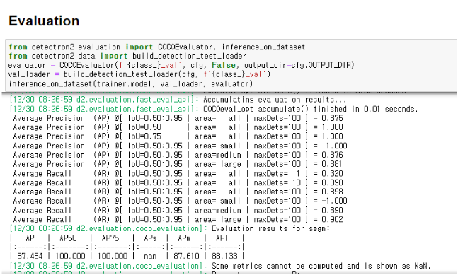

# 69번 지능형 곤충 스마트팜(누에, 쌍별귀뚜라미) 데이터 모델편

---
## 모델
### 1. AI 곤충 영상 분석모델
- 모델 명: Detectron2
- 모델 버전: 0.6v

#### 모델 Description
- Detectron2는 Facebook AI 연구소의 최신식 객체 탐지 알고리즘 입니다. 이 모델은 Detectron과 maskrcnn-benchmark의 후속 알고리즘이며 페이스북의 다수의 컴퓨터 비전 프로젝트나 프로그램에 적용 됐습니다.

##### 모델 Task

 + 객체탐지(Instance segmentation)\
    
   + 출처: Splash of Color: Instance Segmentation with Mask R-CNN and TensorFlow -
Waleed Abdulla
##### Backbon
 + Resnet-50\
    
   - 출처: Automated segmentation of martensite-austenite islands in bainitic steel - Deniz İren
#### Parameters
| 모델 파라미터 | 값     | 비고         |
|---------|-------|------------|
| COCO-InstanceSegmentation/mask_rcnn_R_101_FPN_3x  | -     | 학습 구조 및 모델 |
| DATALOADER.NUM_WORKERS    | 2     | 사용할 코어 수   |
| SOLVER.IMS_PER_BATCH    | 2     | 배치 사이즈     |
| SOLVER.BASE_LR    | 0.001 | 학습률        |
| SOLVER.MAX_ITER   | 8000  | 학습량        |
| MODEL.ROI_HEADS.BATCH_SIZE_PER_IMAGE    | 128   | 미니배치 사이즈   |
| MODEL.ROI_HEADS.NUM_CLASSES   | 4     | 클래스 개수     |

#### Input
    - polygon 좌표 : [(x1,y1),(x2,y2),(x3,y3)....]

#### Output
    - 해당 이미지안의 각 객체 Class

#### Evaluation
    - 목표 mAP 80% 이상
    - 결과 84.561

### 2. AI 곤충 생육 환경 분석모델
- 모델 명: Randomforest
- 모델 버전: 4.7

#### 모델 Description
 - Random Forest는 Decision Tree를 바탕으로 Bagging
의 개념을 적용한 알고리즘이다. 데이터셋에서 임의 복원 샘플링을 통해 
다수의 데이터셋(부분집합)을 생성하는데 이것을 Boostrap
샘플링이라고 한다. 샘플링한 다수의 데이터셋으로 예측모델을 수립하여 분류의 경우에는 다수결투표로
최종값으로 출력한다. 이러한 과정을 Aggregating이라고 한다. 이러한 Boostrap 샘플링과 Aggregating을 함께
사용한 알고리즘이 Bagging이고, Bagging을 적용
한 대표적인 예시가 Random Forest이다. Bagging은 모
델의 편의는 유지되고, 특정 데이터에 Overfitting되는
것을 방지하며 분산을 감소시킬 수 있는 장점이 있다.

##### 모델 Task

+ 구조\
    
+ 분류분석
    
  + 출처: 한국정보통신학회논문지 - 머신러닝을 활용한 제품 특성 예측모델의 성능향상 방법 연구

#### Parameters

| 모델 파라미터                              | 값      | 비고                   |
|--------------------------------------|--------|----------------------|
| RandomForestClassifier               | -      | 학습 구조 및 모델           |
| n_estimators                         | 50     | 학습시 생성할 트리 개수        |
| max_depth                            | 3      | 트리의 최대 깊이 |

### Training Dataset
    
    - 센서 값
      - 온도, 습도, CO2농도, 표면습도, 조도, 암모니아 농도, 실내산소, 외부풍속 등)
    - 곤충 길이 값 (단위:mm)

    

#### Input
    - 생육환경데이터(2차원배열) : [[x1, x2, x3,...], [x1, x2, x3,...],...]
    - 곤충길이데이터(1차원배열) : [y1, y2, y3...]

#### Output
    - 생육환경에 대한 곤충길이 : 34

### Evaluation

    - 목표 mae 10 이하
    - 결과 0.59966...

---

